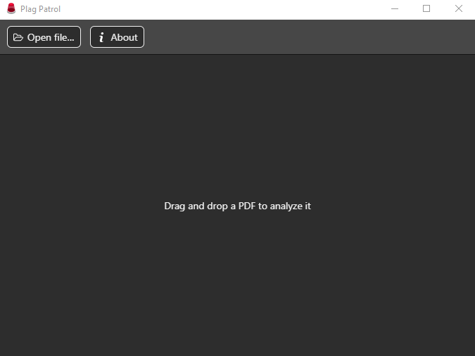

<h1 align="center">
  <a href="http://www.amitmerchant.com/electron-markdownify"></a><br>
  Plag Patrol<br>
</h1>
<h4 align="center">An app for detecting documents tampered to bypass plagiarism detectors</h4>

<p align="center">
  <a href="https://travis-ci.com/josemmo/plagpatrol"></a>
  <a href="https://github.com/josemmo/plagpatrol/releases/latest"></a>
  <a href="LICENSE"></a>
</p>

<p align="center">
  
</p>

## Introduction
Plag Patrol is an app for finding suspicious alterations in PDF documents made to bypass certain plagiarism detection tools, such as [Turnitin](https://www.turnitin.com/) and [Compilatio](https://www.compilatio.net/), based on a paper that will be published in the upcoming weeks.

Basically, what this app does is highlight all sections of a page **not visible to the naked eye** which will modify the plain text recognized by such tools, thus altering the final plagiarism score of the document.

## Installation
Please visit the [releases section](https://github.com/josemmo/plagpatrol/releases/latest) in this repository to download the latest binary for your Operating System.

If you prefer to build the app yourself, you'll need NodeJS with NPM/Yarn:
```bash
# Clone this repository
git clone https://github.com/josemmo/plagpatrol
cd plagpatrol

# Install dependencies
npm install

# Build the app
npm run build
```

## License
Plag Patrol is provided under the [MIT license](LICENSE) and is powered by these awesome technologies:
- [Electron](https://electronjs.org/)
- [jQuery](https://jquery.com/)
- [PDF.js](https://mozilla.github.io/pdf.js/)
- [Webpack](https://webpack.js.org/)
